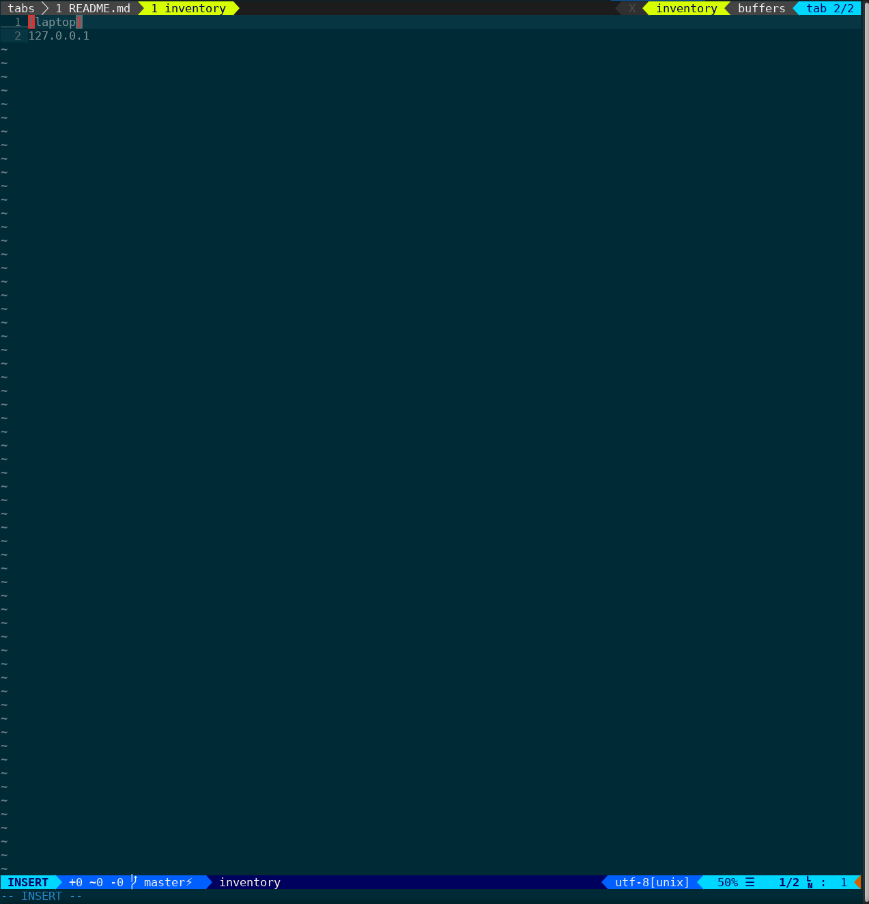

# Dushan's vim setup

Ansible tooling to configure vim and tmux, should work on any recent Fedora (will not work on other platforms due to leveraging Fedora upstream packages)

### Configuration

See `host_vars/127.0.0.1`

### Usage

0. `sudo dnf -y update`
1. `sudo dnf -y install ansible make git python3-dnf python3-libselinux`
2. `make`

### Post invocation

Change GNOME Terminal font to `DejaVu Sans Mono 18` and the colour scheme to `Solarized Dark`, then restart the Terminal Emulator

### What it looks like

If yours looks different or something has broken upstream, please raise an issue

